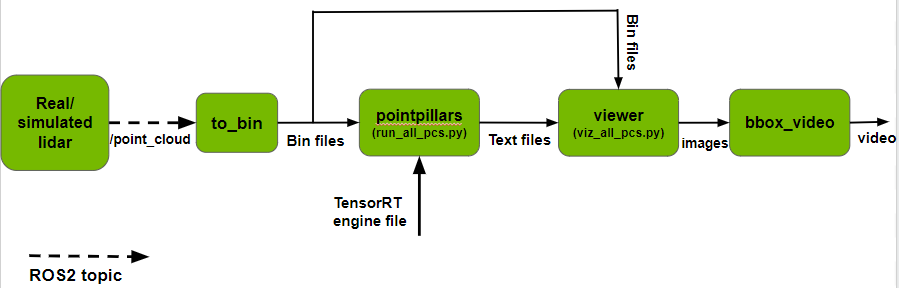

# Visualization tool for 3D bounding box results of ROS2 TAO-PointPillars

This project contains a ROS2 node that converts [PointCloud2](https://docs.ros2.org/foxy/api/sensor_msgs/msg/PointCloud2.html) messages to bin files in KITTI format. The project also includes a workflow and scripts to visualize output of 3D object detection in point clouds using [TAO-PointPillars](https://catalog.ngc.nvidia.com/orgs/nvidia/teams/tao/models/pointpillarnet). This workflow generates a video of resulting bounding boxes superimposed on input point clouds.

<p align="center" width="100%">

</p>

Files in this repository:

1. `to_bin` - ROS2 node to convert PointCloud2 messages to bin files. If you already have bin files for your data, please skip to step 2 below. This node subscribes to PointCloud2 messages from a real or simulated lidar on the `/point_cloud` topic, and creates a bin file for each point cloud. To read data from a generated bin file (say, pointcloud1.bin):
```
import numpy as np
pc = np.fromfile("pointcloud1.bin", dtype=np.float32).reshape((-1, 4))
x, y, z, intensity = np.split(pc, 4, axis=1)
```
To run this node, create, build and source your own [ROS2 workspace](https://docs.ros.org/en/foxy/Tutorials/Beginner-Client-Libraries/Creating-A-Workspace/Creating-A-Workspace.html). Create a folder to store all the generated bin files and run the following command:
```
ros2 run to_bin convert_to_bin --ros-args -p output_path:="absolute-path-to-save-bin-files" -p intensity_range:=<float-to-scale-intensity>
# For example:
ros2 run to_bin convert_to_bin --ros-args -p output_path:="/home/bin_files/" -p intensity_range:=255.0
```

The argument `intensity_range` is a float value specifying the scale factor for dividing intensity. For example, if your model is trained on data where point intensity is in the range [0.0 - 1.0] and input data at inference has intensity in the range [1 - 255], this parameter should be set to 255.0 so that input data matches training data.

2. `run_all_pcs.py` - Runs PointPillars inference for all bin files in a folder. Please follow the steps given [here](https://github.com/NVIDIA-AI-IOT/tao_toolkit_recipes/tree/main/tao_pointpillars/tensorrt_sample) to build and use the TAO-PointPillars model.

Replace `test/main.cpp` from the [tensorrt_sample](https://github.com/NVIDIA-AI-IOT/tao_toolkit_recipes/tree/main/tao_pointpillars/tensorrt_sample) repo with `main.cpp` from this repo to generate and save results in a text file for each input bin file. Create a folder to save output text files. Re-build the project, copy `run_all_pcs.py` from the repo to the `build` folder and run:
```
mkdir build && cd build
cmake .. -DCUDA_VERSION=<CUDA_VERSION>
make -j8

python3 run_all_pcs.py <class_names> <nms_iou_thresh> <pre_nms_top_n> <absolute-engine-path> <absolute-input-path> <data-type> <absolute-output-path> <--do_profile>
# For example:
python3 run_all_pcs.py "Vehicle,Pedestrian,Cyclist" 0.01 4096  "/home/trt.fp16.engine" "/home/bin_files/" "fp16" "/home/text_files/" --do_profile
```

Below is a description of each argument:
- class_names: List of object classes detected by the model 
- nms_iou_thresh: Float value specifying NMS IOU threshold
- pre_nms_top_n: Float value specifying number of top `n` boxes to use for NMS
- absolute-engine-path: Absolute path to TensorRT engine generated using tao-converter
- absolute-input-path: Absolute path to input bin files
- data-type: String specifying data type ("fp32" or "fp16")
- absolute-output-path: Absolute path to output folder
- --do_profile: Optional argument - add this to the end of the command to perform profiling

Text files with inference results will be saved in the output folder. Each text file will have the same name as the bin file that generated it. For instance, `1.txt` contains inference results for `1.bin`.

3. `viz_all_pcs.py` - Generates and saves an image for each bin file and corresponding text file. This is based on the visualization tool from [here](https://github.com/hova88/PointPillars_MultiHead_40FPS/tree/main/tools). Ensure that each (bin file, text file) pair have the same name. For example, `1.bin` must have a corresponding `1.txt`. The resulting image will also be saved with the same name `1.png`.

To run this code, your machine must be running Xserver.

Create a folder named `visualize` and copy `visual_tools` and `viewer.py` from this repo to it. The structure should look like this:
```
.
+- viz_all_pcs.py (from this repo)
+- visualize
   +- visual_tools
   +- viewer.py
``` 

Create a folder to store resulting images. To run:
```
python3 viz_all_pcs.py <absolute-path-to-input-bin-files> <absolute-path-to-input-text-files> <absolute-path-to-save-output-images>
# For example:
python3 viz_all_pcs.py "/home/bin_files/" "/home/text_files/" "/home/result_images/"
```
4. `bbox_video.py` - Merges png images sequentially into a video for viewing point clouds with resulting detections overlaid as 3D bounding boxes. To run:
```
python3 bbox_video.py <absolute-path-to-images-folder> <absolute-path-to-save-output-video>
# For example:
python3 bbox_video.py "/home/result_images/" "/home/video.avi"
```


<p align="center" width="100%">

</p>

## Related projects
[ros2_tao_pointpillars](https://github.com/NVIDIA-AI-IOT/ros2_tao_pointpillars): ROS2 node for 3D object detection in point clouds using TAO-PointPillars.

## Support
Please reach out regarding issues and suggestions [here](https://github.com/NVIDIA-AI-IOT/viz_3Dbbox_ros2_pointpillars/issues).

